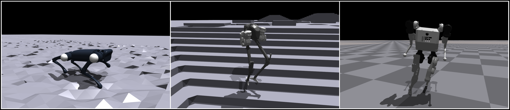

# Fully Spiking Neural Network for Legged Robots


# rl-robotics

## Introduction
A Learning-based locomotion controller for quadruped robots, which can be deployed on Huawei Ascend Atlas 200I DK A2. It includes all components needed for sim-to-real development on Unitree A1 and DeepRobotics Lite3.
## Software architecture
This repository consists of below directories:
- rsl_rl: a package wrapping RL methods.
- legged_gym: gym-style environments of quadruped robots.
- third_party: containing pytorch version of EKF.

The main scripts are located at `${PROJECT_DIR}/legged_gym/legged_gym/scrips/`.


## Prepare environment 
1.  Create a python (3.6/3.7/3.8, 3.8 recommended) environment on Ubuntu OS.

2.  Install pytorch with cuda.
```
# pytorch
pip3 install torch==1.10.0+cu113 torchvision==0.11.1+cu113 torchaudio==0.10.0+cu113 -f https://download.pytorch.org/whl/cu113/torch_stable.html
```

3.  Download Isaac Gym (version >=preview 3) from the official website and put it into the root directory of the project.

4. Install python dependencies with pip.
```
pip3 install transformations matplotlib gym tensorboard cupy
```
5. Download the pre-trained models into `${PROJECT_DIR}/legged_gym/logs/[rough_a1 | rough_lite3]/pre-trained` from the following URLs. 
- [Ascend offline model (*.om) for Unitree A1](https://ascend-repo.obs.cn-east-2.myhuaweicloud.com/Atlas%20200I%20DK%20A2/DevKit/models/23.0.RC1/cann/A1_deploy.om)
- [Pytorch model for Unitree A1](https://ascend-repo.obs.cn-east-2.myhuaweicloud.com/Atlas%20200I%20DK%20A2/DevKit/models/23.0.RC1/cann/A1.pt)
- [Pytorch model for DeepRobotics Lite3](https://ascend-repo.obs.cn-east-2.myhuaweicloud.com/Atlas%20200I%20DK%20A2/DevKit/models/23.0.RC1/cann/Lite3.pt)


6. Compile the robot SDK of Unitree A1 and DeepRobotics Lite3 for real robot deployment.
```
# Unitree A1
cd ./legged_gym/legged_gym/envs/a1/a1_real/unitree_legged_sdk
# After entering the SDK directory, compile the code
mkdir build && cd build
cmake .. && make
cp *.so ../../
```
```
# DeepRobotics Lite3
cd ./legged_gym/legged_gym/envs/lite3/lite3_real/deeprobotics_legged_sdk
# After entering the SDK directory, compile the code
mkdir build && cd build
cmake .. && make
cp *.so ../../
``` 

# Usage

### Run controller in the simulation
```
cd ${PROJECT_DIR}
python3 legged_gym/legged_gym/scripts/play.py --task a1 --rl_device cuda:0 --sim_device cuda:0 --load_run ${model_dir} --checkpoint ${model_name}
```
Check that your computer has a GPU, otherwise, replace the word `cuda:0` with `cpu`.
You should assign the path of the network model via `--load_run` and `--checkpoint`. 
If you want to play Lite3 robot, replace `a1` with `lite3`  for keyword `--task`. 
Please refer to `get_args` in `/legged_gym/legged_gym/utils/helpers.py` for other params.

### Run controller in the real-world
Just add `_real` substring into task name. Such as the following,
```
cd ${PROJECT_DIR}
python3 legged_gym/legged_gym/scripts/play.py --task a1_real --rl_device cuda:0 --sim_device cuda:0 --load_run ${model_dir} --checkpoint ${model_name}
```

### Run inference on Ascend Atlas 200I (NPU) in the real-world. 
As playing controller in inference mode, you can just add `--use_npu` keyword in the command line. 
Remember to set `--load_run` and `--checkpoint` with `.om` model directory and model name. 
```
cd ${PROJECT_DIR}
python3 legged_gym/legged_gym/scripts/play.py --task a1_real --use_npu --load_run pre-trained --checkpoint A1_deploy.om
```


### Train policy in the simulation
```
python3 legged_gym/legged_gym/scripts/train.py --task a1 --rl_device cuda:0 --sim_device cuda:0
```
Use `--load_run` and `--checkpoint` to load pre-trained pytorch model.\
Use `--headless` to disable the GUI graphical rendering for saving GPU memory.\
Once the training process finishes, you can deploy it in the simulation or the real-world.

## Advances
- Joy Control

    It is supported to use gamepad (Logitech F710 recommended) to send speed commands to control quadruped in play mode.
- Modify configurations
    
    Modify robot configuration files if you want to adjust environment or robot parameters.

    * DeepRobotics Lite3 : legged_gym/legged_gym/envs/lite3/lite3_config.py
    * Unitree A1 : legged_gym/legged_gym/envs/a1/a1_config.py


## Participate contribution
1.  Fork this depository
2.  Create feat/xxx branch
3.  Commit code
4.  Create Pull Request

## Reference
[legged_gym] https://github.com/leggedrobotics/legged_gym.git

## Communication
If you have any question, please join our discussion group by scanning the following wechat QR code.
